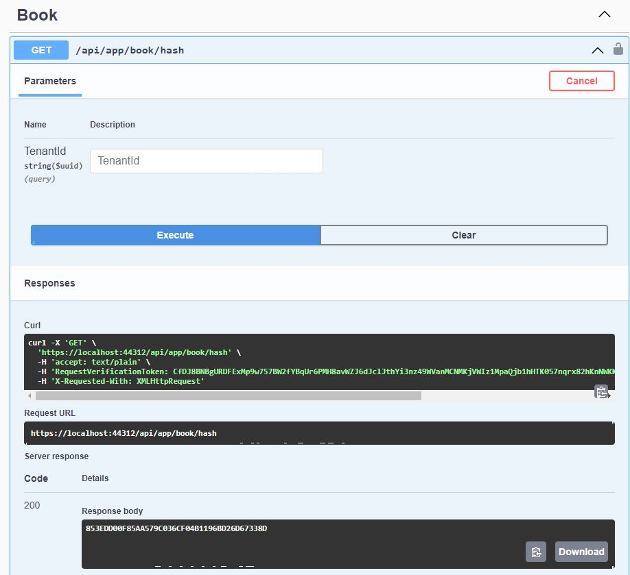

## A BaseEfCoreRepository class that inherits from EfCoreRepository

## Introduction

Today, I wanted to know if the content of a table in the database had changed or not. I ended up with creating a **ComputeHash** method that returns a different hash when the content of a table in the database has been updated.

After I created this method, I asked myself, how can I expose this method to my other Repository classes? This is the solution that I came up with.

Keep in mind that, the code in this article is **by no means production-ready**, as I wanted to keep the example simple to understand. And the ComputeHash method has also room for improvement.

## Source Code

The source code of the completed application is [available on GitHub](https://github.com/bartvanhoey/AbpBaseEfCoreRepository).

## Requirements

The following tools are needed to run the solution.

- .NET 6.0 SDK
- Vscode, Visual Studio 2022, or another compatible IDE.
- ABP CLI Version 6.0.0

## Development

### Create a new ABP Framework Application

- Install or update the ABP CLI:

```bash
dotnet tool install -g Volo.Abp.Cli || dotnet tool update -g Volo.Abp.Cli
```

- Use the following ABP CLI command to create a new Blazor ABP application:

```bash
abp new BookStore -u blazor -o BookStore
```

### Open & Run the Application

- Open the solution in Visual Studio (or your favourite IDE).
- Run the `BookStore.DbMigrator` application to apply the migrations and seed the initial data.
- Run the `BookStore.HttpApi.Host` application to start the server-side.

To follow along, you will need to have the first part of the [BookStore tutorial](https://docs.abp.io/en/abp/latest/Tutorials/Part-1?UI=Blazor&DB=EF) ready.

## Create a BaseEfCoreRepository class

Create a folder **BaseEfCoreRepo** in the **EntityFrameworkCore project** and add a class **BaseEfCoreRepository.cs**.
As you can see below, the class inherits from **EfCoreRepository** and is made abstract. The ComputeHash method calculates a Hash for a given list of string input.

You also need to implement the DeleteAsync, the DeleteManyAsync, the FindAsync and the GetAsync methods.

```csharp
using System.Collections.Generic;
using System.Linq;
using System.Security.Cryptography;
using System.Text;
using System.Threading;
using System.Threading.Tasks;
using BookStore.EntityFrameworkCore;
using Microsoft.EntityFrameworkCore;
using Volo.Abp.Domain.Entities;
using Volo.Abp.Domain.Repositories;
using Volo.Abp.Domain.Repositories.EntityFrameworkCore;
using Volo.Abp.EntityFrameworkCore;
using static System.String;
using static System.Text.Encoding;

namespace BookStore.BaseEfCoreRepo
{
    public abstract class BaseEfCoreRepository<TEntity, TKey> : EfCoreRepository<BookStoreDbContext, TEntity>,
        IBasicRepository<TEntity, TKey>
        where TEntity : class, IEntity<TKey>
    {
        protected BaseEfCoreRepository(IDbContextProvider<BookStoreDbContext> dbContextProvider) : base(dbContextProvider)
        {
        }

        protected string ComputeHash(IEnumerable<string> strings)
        {
            var items = strings.ToList();
            if (!items.Any())
            {
                return Empty;
            }

            using var sha1 = new SHA1Managed();
            var bytes = sha1.ComputeHash(UTF8.GetBytes(Concat(items)));
            var builder = new StringBuilder(bytes.Length * 2);
            foreach (var b in bytes) // can be "x2" if you want lowercase
            {
                builder.Append(b.ToString("X2"));
            }
            return builder.ToString();
        }

        public async Task DeleteAsync(TKey id, bool autoSave = false, CancellationToken cancellationToken = default)
            => await base.DeleteAsync(x => x.Id.Equals(id), autoSave, cancellationToken);

        public async Task DeleteManyAsync(IEnumerable<TKey> ids, bool autoSave = false,
            CancellationToken cancellationToken = default)
        {
            var entities = await (await GetDbSetAsync()).Where(x => ids.Contains(x.Id)).ToListAsync(cancellationToken);
            await base.DeleteManyAsync(entities, autoSave, cancellationToken);
        }

        public async Task<TEntity> FindAsync(TKey id, bool includeDetails = true,
            CancellationToken cancellationToken = default)
            => await base.FindAsync(x => x.Id.Equals(id), includeDetails, cancellationToken);

        public async Task<TEntity> GetAsync(TKey id, bool includeDetails = true,
            CancellationToken cancellationToken = default)
            => await base.GetAsync(x => x.Id.Equals(id), includeDetails, cancellationToken);
    }
}

```

## Interface **IHaveGetHashAsyncRepository.cs**

Create a folder **Interfaces** in the **Domain project** and add the interface **IHaveGetHashAsyncRepository.cs**

Every Repository that implements the **IHaveGetHashAsyncRepository** interface will need to implement the **GetHashAsync** method

```csharp
using System;
using System.Threading.Tasks;
using Volo.Abp.Domain.Entities;
using Volo.Abp.Domain.Repositories;

namespace BookStore.Domain.Interfaces
{
    public interface IHaveGetHashAsyncRepository<TEntity, TKey> : IRepository<TEntity, TKey> where TEntity : class, IEntity<TKey>
    {
         Task<string> GetHashAsync(Guid? tenantId);
    }
}
```

## IBookRepository in the **Domain project**

Create an **IBookRepository** interface in the **Books** folder of the **Domain** project that implements the **IHaveGetHashAsyncRepository** interface

```csharp
using System;
using BookStore.Domain.Interfaces;
using Volo.Abp.Domain.Entities;
using Volo.Abp.Domain.Repositories;

namespace BookStore.Domain.Books
{
    public interface IBookRepository: IHaveGetHashAsyncRepository<Book, Guid>
    {
        
    }
}
```

## BookRepository in the **EntityFrameworkCore project**

Create a **BookRepository** class in the **Books** folder of the **EntityFrameworkCore** project.
Let the **BookRepository** class inherit from the **BaseEfCoreRepository** class you created, and also implement the **IBookRepository** interface.

When you implement the **IBookRepository** interface you will need to have a **GetHashAsync** method in your **BookRepository** class.
In method you can now call the **ComputeHash** method from the **BaseEfCoreRepository** class.

```csharp
using System;
using System.Linq;
using System.Threading.Tasks;
using BookStore.BaseEfCoreRepo;
using BookStore.Domain.Books;
using Volo.Abp.EntityFrameworkCore;

namespace BookStore.EntityFrameworkCore.Books
{
    public class BookRepository : BaseEfCoreRepository<Book, Guid>, IBookRepository
    {
        public BookRepository(IDbContextProvider<BookStoreDbContext> dbContextProvider) : base(dbContextProvider)
        {
        }

        public async Task<string> GetHashAsync(Guid? tenantId)
        {
            using var disposable = CurrentTenant.Change(tenantId);
            return ComputeHash((await GetDbContextAsync()).Books.Select(x => $"{x.Id}{x.Name}{x.Type}{x.PublishDate}{x.Price}"));
        }
    }
}
```

## GetHashDto class and GetHashAsync interface method definition

Create a **GetHasDto** class in the **Books** folder of the **Application.Contracts**

```csharp
using System;

namespace BookStore.Books
{
    public class GetHashDto
    {
        public Guid? TenantId { get; set; }
    }
}
```

In the **IBookAppService** interface add a **GetHashAsync** method definition to the

```csharp
using System;
using System.Threading.Tasks;
using BookStore.Application.Contracts.Books;
using Volo.Abp.Application.Dtos;
using Volo.Abp.Application.Services;

namespace BookStore.Books
{
    public interface IBookAppService :
        ICrudAppService<BookDto, Guid, PagedAndSortedResultRequestDto, CreateUpdateBookDto>, IApplicationService
    {
        Task<string> GetHashAsync(GetHashDto input);
    }
}
```

## BookAppService in the Application project

Update the content of **BookAppService** class in the **Application** project.

```csharp
using System;
using System.Threading.Tasks;
using BookStore.Application.Contracts.Books;
using BookStore.Domain.Books;
using Volo.Abp.Application.Dtos;
using Volo.Abp.Application.Services;

namespace BookStore.Books
{
    public class BookAppService : CrudAppService<Book, BookDto, Guid, PagedAndSortedResultRequestDto, CreateUpdateBookDto>, IBookAppService
    {
        private readonly IBookRepository _repository;

        public BookAppService(IBookRepository repository) : base(repository) => _repository = repository;

        public async Task<string> GetHashAsync(GetHashDto input) 
            => await _repository.GetHashAsync(input.TenantId);
    }
}
```

I added the **GetHashAsync** method in the BookAppService only for testing purposes.

## Testing

Start the **BookStore.HttpApi.Host** project to have the **Swagger** page launched.
Navigate to the **api/app/book/hash endpoint** in the Swagger page.

Click first on the **Try it out** button and then on the **Execute** button.

The **GetHashAsync** method in the **BookAppService** will be hit and should return every time the same hash string when you have the same 2 books in the database.

If you delete one of them, the method will return another hash.



Get the [source code](https://github.com/bartvanhoey/AbpBaseEfCoreRepository.git) on GitHub.

Enjoy and have fun!
